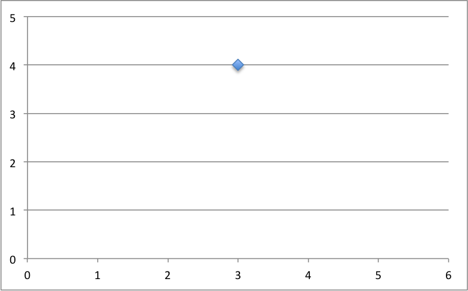
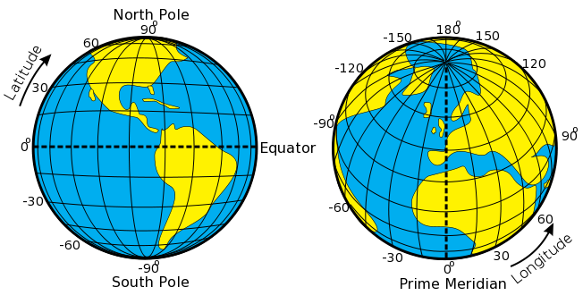
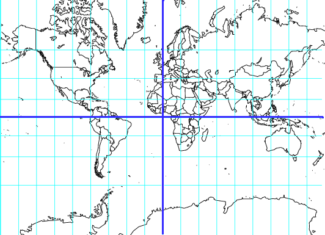

Geographic data can mean a lot of things, but it's simply a way to communicate information with spatial relevance.

For example, let's say you want to meet a friend for lunch. You want to go to The Burger Barn, but you know there are two, and you know your friend is indecisive. 

"Let's eat at The Burger Barn on 8th and Flower. They close at 2, so leave soon."

In that simple sentence, you've just communicated a fair amount of information with a central geographic point. There's the restaurant's name, its address (the geographic info), and its closing time. Humans are great at communicating a bunch of information to eachother in free-form language, but computers really shine with structured information, so let's construct a table with all of that info:

Name | Address | Closing time
--- | --- | ---
Burger Barn | W 8th St and S Flower St, Los Angeles, CA |  14:00

This is geographic data, and a computer can use it. However, our location -- the address -- can be further refined so a computer can map the exact spot on the Earth without needing to know the ins and outs of downtown Los Angeles.

Humans have learned to readily understand and associate an address with a location, but we can turn that address into an exact point on the Earth's surface using a process called geocoding.

We will get to geocoding more in-depth in a bit, but for now, suffice it to say the same process that let's you type "134 Main St." into your phone, resulting in directions and a map to your dentist's office, can be harnessed for our own purposes.

There are many geocoders, but a decent and free web-based one for the US is geocoder.us. Go to http://geocoder.us in your browser, and type in "W 8th St and S Flower St, Los Angeles, CA" to the search box. Hit submit.

You should come up with this page here: http://geocoder.us/demo.cgi?address=W+8th+St+and+S+Flower+St%2C+Los+Angeles%2C+CA

The geocoder now not only has the address -- with the zip code, since it was able to locate the point and therefore determine the postal zip -- but a latitude and longitude for the address. This latitude and longitude number together creates a geographic point, like an address to describe any spot on the planet.

Let's copy that latitude / longitude pair after the address and put it into our table. This is our new point data.

Name | Address | Point | Closing time
--- | --- | --- | ---
Burger Barn | W 8th St and S Flower St, Los Angeles, CA | 34.047281, -118.260155 | 14:00

If you want to verify this strange series of numbers means the same thing as our address, you can paste it into Google Maps: https://maps.google.com/maps?q=34.047281,-118.260155. Looks about right to me!

So that's how you get point data from an address. But what are latitude and longitude anyhow? For that we should go back to very basic geometry.

What you have here is a simple (x, y) plot of the point (3, 4). In the same way that (3, 4) describes a point on this grid, (34.047281, -118.260155) describes a point on a grid over the earth:

Although in this case, latitude is actually the Y axis, and longitude is the X axis, so our lat/lon pair is in the form (y, x). Some geographic systems accept points in (y, x), some in (x, y). It can get confusing.

Here's that same grid flattened out in a process we call projection. We will get to projections in a bit, but imagine it's like taking a beach ball with a globe printed on it, deflating it and cutting it down the side to flatten it out.

The blue cross in the center is (0, 0). The far left side of the blue line is (0, -180) while the far right side is (0, 180). The top of the blue line is (90, 0), while the very bottom is (-90, 0).

Now perhaps you can imagine starting at (0, 0) on the world grid, moving over to the -118 line, then up to the 34 line, and you'd be relatively close to our restaurant. Relative in geographic terms anyway -- you'd be about a 30 minute drive on the freeway. Those decimal points really matter when we're talking geographic precision.
